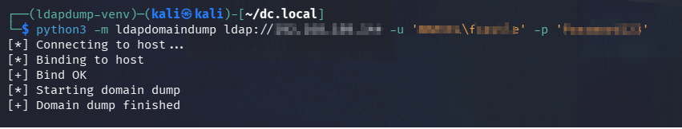
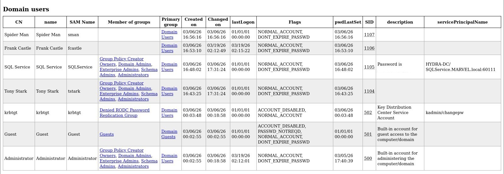
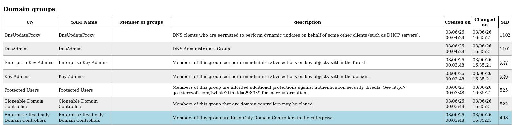

# Domain Enumeration with ldapdomaindump

## Objective

Enumerate Active Directory objects (users, groups, computers) using LDAP.

## Lab Setup

- Attacker: Kali Linux
- Target: Domain Controller (LDAP 389)
- Tool: ldapdomaindump (Python venv)

## Command

```bash
python3 -m ldapdomaindump ldap://<TARGET_IP> -u '<DOMAIN\\username>' -p '<PASSWORD>'

```

## 📸 Screenshots





## 📊 Result

- Domain users extracted
- Domain groups identified
- Domain computers enumerated
- HTML reports generated for analysis

## 🔍 Key Findings

- Multiple Domain Admins identified
- SQLService account with exposed password in description
- High-privilege access possible without password cracking

## ⚠️ Issues Faced

- LDAPS (636) not working → switched to LDAP (389)
- NTLM format error → corrected to DOMAIN\username
- MD4/OpenSSL compatibility issue → resolved using Python virtual environment

## 🛡️ Defense

- Remove passwords from account descriptions
- Restrict LDAP access where possible
- Apply least privilege principle
- Monitor and audit Domain Admin group members

## 🧠 Key Insight

- LDAP enumeration can reveal critical domain information, including credentials, without performing any active attack.
