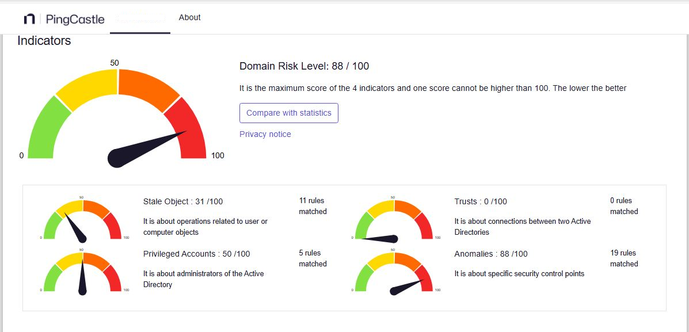

# 🛡️ PingCastle Lab – Active Directory Security Assessment

## 📌 Overview

In this lab, I used **PingCastle** to perform a security assessment of an Active Directory environment.
The goal was to identify misconfigurations, weak policies, and potential security risks within the domain.

---

## 🧪 Lab Environment

- **Attacker Machine:** Kali Linux
- **Target Machine:** Domain-joined Windows machine (THEPUNISHER-2)
- **Domain:** MARVEL.local
- **User:** fcastle

---

## ⚙️ Tool Used

- **PingCastle (v3.5.0.44)**
  - Active Directory security assessment tool
  - Generates detailed HTML reports with risk analysis

---

## 🚀 Installation

1. Download PingCastle from GitHub:
   https://github.com/netwrix/pingcastle/releases

2. Extract the ZIP file:
   - Right click → Extract All

---

## ▶️ Execution

Run PingCastle on the domain-joined machine:

```bash
PingCastle.exe
```

Steps performed:

1. Selected **Healthcheck (default)**
2. Enabled **Privileged Mode (Yes)**
3. Used default domain:

```bash
MARVEL.local
```

---

## 📄 Output

PingCastle generated an HTML report:

```bash
ad_hc_MARVEL.local.html
```

This report contains:

- Risk score
- Security findings
- Domain configuration issues
- Privileged account analysis

---

## 📸 Screenshots



## 🔍 Key Findings (Example)

- Weak password policies
- Privileged group misconfigurations
- Missing security controls
- Potential attack paths in Active Directory

---

## 🎯 Key Learning

- PingCastle provides a quick overview of AD security posture
- Helps identify high-risk misconfigurations
- Useful for both defenders and penetration testers
- HTML reports are easy to analyze and share (after sanitization)

---

## ⚠️ Note

Sensitive information (like usernames, domain details) has been excluded for security reasons.

---

## 📌 Conclusion

PingCastle is a powerful and easy-to-use tool for auditing Active Directory environments.
It helps quickly identify weaknesses and improves overall domain security.

---

## 🔗 Author

- GitHub: https://github.com/bilalhunzla
