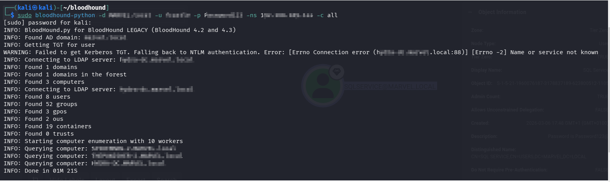
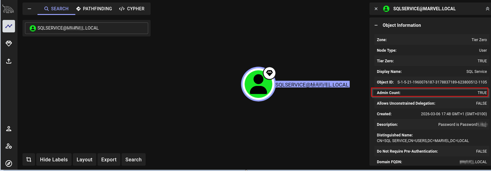
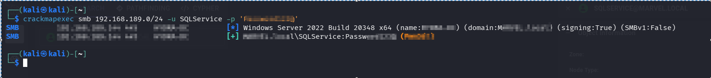

# 🛡️ Active Directory Lab – BloodHound Analysis & Privilege Escalation

## 📌 Objective

The purpose of this lab was to enumerate an Active Directory environment, identify weak configurations, and exploit them to achieve privilege escalation.

---

## 🧪 Lab Environment

- **Attacker Machine:** Kali Linux
- **Target:** Windows Server 2022 (Domain Controller)
- **Domain:** YOURDOMAIN.local
- **Tools Used:**
  - BloodHound
  - bloodhound-python
  - CrackMapExec
  - Impacket (psexec, wmiexec)

---

## 🔍 Enumeration Phase

### 1. BloodHound Data Collection

```bash
bloodhound-python -d YOURDOMAIN.local -u <USERNAME> -p '<PASSWORD>' -ns <TARGET_IP> -c all
```

- Domain objects were enumerated
- Users, groups, computers, and relationships were extracted
- JSON files were generated

---

### 2. Data Analysis (BloodHound)

- Data was imported into BloodHound
- User relationships were analyzed
- **SQLService account was identified as a potential attack vector**

---

## ⚠️ Key Finding

> 🔴 Credentials exposed in SQLService account description:

```
Password: <REDACTED>
```

- This is a **critical security misconfiguration**
- Sensitive credentials were publicly accessible

---

## 🚀 Exploitation Phase

### 1. Credential Validation

```bash
crackmapexec smb <TARGET_NETWORK> -u <USERNAME> -p '<PASSWORD>'
```

- Successful authentication achieved
- Administrative access to the Domain Controller confirmed (**Pwn3d!**)

---

### 2. Remote Shell Access

```bash
psexec.py YOURDOMAIN.local/<USERNAME>:'<PASSWORD>'@<TARGET_IP>
```

- SYSTEM-level shell obtained
- Full control over the Domain Controller

---

## 🎯 Result

- Valid credentials were obtained
- Domain Controller was successfully compromised
- Privilege escalation was achieved

---

## 🧠 Key Learnings

- BloodHound is a powerful tool for Active Directory analysis
- Misconfigured attributes (e.g., description fields) can expose sensitive data
- Credential reuse can lead to full domain compromise
- Enumeration is a critical phase in penetration testing

---

## 🔐 Security Recommendations

- ❌ Do not store passwords in description fields
- ✔️ Follow the principle of least privilege
- ✔️ Implement regular security audits and monitoring
- ✔️ Restrict access to sensitive attributes

---

## 📸 Screenshots

_Add your screenshots here_

```



```

---

## 📚 Author

**Hunzla Bilal**

- Cybersecurity Learner
- Active Directory & Ethical Hacking Labs

---

## ⚠️ Disclaimer

This lab is intended for educational purposes only.
Testing on unauthorized systems is illegal.
